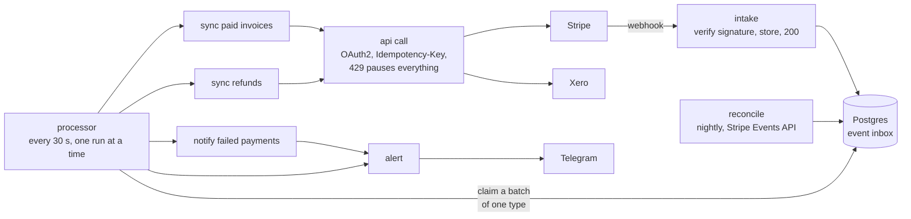

# Stripe → Xero sync on n8n

Every paid Stripe invoice becomes a paid Xero invoice (contact, invoice, payment into the bank account).
Every refund becomes a Xero credit note paid back out of that account. Failed card payments go to Telegram.

The hard part is not the mapping. It is everything that goes wrong between two APIs: Stripe sends
the same event twice, or out of order, or not at all. Xero allows 60 calls a minute and sometimes times out after
it has already saved the request. n8n restarts in the middle of a batch. This sync is built and tested for all of
that. Its end state is checked against Stripe, document by document.

## Proof

`tools/soak.py` runs the whole thing on a local n8n against a mock of Xero and Stripe that enforces Xero's
documented limits and validation. Then it compares every contact, invoice, payment and credit note with what Stripe
says should exist. One full run:

| | |
|---|---|
| Stripe events | 1,753: 1,523 `invoice.paid`, 155 `refund.created`, 75 `invoice.payment_failed` |
| Deliveries | 2,328, shuffled, so refunds can come before their invoices. 530 repeats were recognised and dropped. 84 forged signatures got a 400 |
| Never delivered | 39, all found by `reconcile` |
| Xero errors | 3 calls answered 503. 4 answers were lost after Xero had saved a contact, an invoice, a payment and a credit note; the lookups found them on retry, so nothing was created twice |
| Xero rate limit | Another workflow spent the minute budget. The sync got a 429, paused all Xero work for 55 s and lost no attempts |
| Tokens | Expired every 90 s instead of 30 min: 6 × 401, each answered with a new token |
| n8n | Killed with SIGKILL while holding 40 events, back in 5 s. The 40 were retried once the lease ran out |
| Outcome | 1,750 synced. 3 refused on purpose: tax, EUR, paid partly from customer balance |
| Check | Xero matches Stripe: 35 contacts, 1,518 invoices, 1,671 payments, 153 credit notes, no duplicates, nothing missing |
| Cost | 259 Xero calls, 0.15 per event. 280 events needed a retry, none more than 3 attempts |
| Time | 14 minutes, 5 of them the stall after the kill |

## How it works



**Store, then answer.** The intake checks the `Stripe-Signature` HMAC over the raw body inside Postgres,
stores the event under its id and answers 200 within milliseconds. A redelivered event is recognised by its id and
counted. A forged one gets a 400. The work itself happens later, at Xero's pace.

**Batches, one type at a time.** Every 30 seconds the processor takes a lease (one run at a time), claims up to 40
due events of the same type and hands them to that type's handler. For 40 paid invoices the handler makes at most
5 Xero calls: find contacts, create contacts, find invoices, create invoices, record payments.

**Look before creating.** Each step first asks Xero what already exists, by keys that come from Stripe:
`ContactNumber` = the Stripe customer id, `InvoiceNumber` = the Stripe invoice number, `Reference` = the Stripe
invoice or refund id. A batch that failed halfway simply runs again and creates nothing twice. PUTs also carry an
`Idempotency-Key` (a hash of the request), so a retry within Xero's 6 minutes gets the first answer back.

**Rate limits.** Every Xero response says how many calls are left this minute. Below 5, the processor pauses all
Xero work for 60 seconds before Xero has to refuse anything. If another integration on the same connection spends
the budget and Xero answers 429, all Xero work waits for `Retry-After` seconds, and no event loses an attempt.

**Failures.** A failed event is retried with backoff (30 s, 1 min, 2 min … up to 1 h) and is marked dead after
8 attempts. It is marked dead at once if retrying cannot help (`PERMANENT:` errors, see [Limits](#limits)). Dead
events are announced on Telegram, and `SELECT replay_dead()` queues them again after a fix. A refund whose invoice
is not in Xero yet waits for up to 2 days without spending attempts. It goes as soon as its invoice is done, and is
otherwise checked again after half the time it has waited so far (30 s to 10 min).

**Crashes.** A run that dies holds its lease and the events it claimed for 5 minutes (`lease_ttl`), so processing
stops for that long. Then the next run takes them back and retries them; the lookups above make that safe. n8n
itself is never trusted to remember anything: all state is in the database.

**Lost webhooks.** Stripe stops retrying after 3 days. Every night `reconcile` lists the last 30 days of handled
events from Stripe's Events API, which keeps events for 30 days. It queues the ones the inbox never received and
announces them on Telegram, since that means the webhook endpoint has a problem. Stripe renders a listed event in
the API version the account had on that day, so each missed object is fetched again in the pinned version.
`POST /webhook/stripe-xero/reconcile` with the ops token runs it on demand.

**Details that break naive syncs.** Two customers named John Smith stay two Xero contacts: names carry the Stripe
customer id, `John Smith (cus_…)`, because Xero requires unique names. Names are cut to Xero's 255 characters.
Discounts are netted per line. An invoice with more lines than the event carries is posted as one line with the
exact total. Amounts are converted per Stripe's zero- and three-decimal currency lists. $0 invoices are skipped.
A second event for the same invoice joins the first one. A refund arriving before its invoice waits for it.
Events rendered in an API version other than the pinned `2026-08-26.dahlia` are refused, because tax fields
differ between versions.

## Workflows

| Workflow | Trigger | Does |
|---|---|---|
| `intake` | `POST /webhook/stripe` | verify, store, answer |
| `processor` | every 30 s | lease, claim batches, dispatch by type, record outcomes, alert on dead events |
| `sync paid invoices` | processor | `invoice.paid` → contact, invoice, payment |
| `sync refunds` | processor | `refund.created` → credit note, refund payment |
| `notify failed payments` | processor | `invoice.payment_failed` → one Telegram message per batch |
| `api call` | handlers | every outbound request: auth, idempotency, rate limits, errors |
| `reconcile` | 03:30 daily, or `POST /webhook/stripe-xero/reconcile` | queue events the webhook never delivered |
| `alert` | other workflows, and as their error workflow | Telegram |

The workflows hold no secrets and no environment-specific values: URLs and account codes are in `app_setting`,
secrets are n8n credentials. The same JSON therefore runs against the mock and against the real APIs.

## Run it

Needs n8n 2.x, PostgreSQL 14+ and Python 3.10+. Everything under `tools/` uses only the standard library.

```sh
# ~/.config/stripe-xero/env holds STRIPE_WEBHOOK_SECRET and OPS_TOKEN (random strings will do for the mock)
# ~/.config/n8nctl/dev.env holds N8N_URL and N8N_API_KEY of the local n8n
set -a; . ~/.config/stripe-xero/env; set +a
createdb stripe_xero_dev
psql -d stripe_xero_dev -f sql/schema.sql
psql -d stripe_xero_dev -v secret="$STRIPE_WEBHOOK_SECRET" <<'SQL'
UPDATE app_setting SET value = 'http://127.0.0.1:8765/xero/api.xro/2.0' WHERE name = 'xero_api_base';
UPDATE app_setting SET value = 'http://127.0.0.1:8765/stripe' WHERE name = 'stripe_api_base';
INSERT INTO app_secret VALUES ('stripe_webhook_secret', :'secret');
SQL
python3 n8nctl.py creds dev credentials.mock.json --env ~/.config/stripe-xero/env
python3 n8nctl.py push dev workflows -m "first push"
python3 tools/soak.py        # about 15 minutes, ends with "soak: OK"
```

The n8n credential "Sync DB" (Postgres) is the one thing to create by hand. The soak kills n8n with
`systemctl --user kill --signal=SIGKILL n8n.service`; pass `--kill-cmd` for another setup, or `--kill-cmd ''` to skip it.

Smaller steps: `tools/test_mock.py` checks the mock, `sql/test.sql` checks the database logic,
`fixtures.py generate` and `replay.py` feed events, and `fixtures.py verify` compares Xero with Stripe.

## Going live

1. Xero: a Custom Connection app (client credentials) with the scopes in `credentials.json`. Check that account
   codes `200` (sales) and `090` (bank) exist, or change them in `app_setting`.
2. Stripe: a restricted key with read access to invoices, invoice payments, refunds and events. Then a webhook
   endpoint pinned to the API version. Its signing secret goes into `app_secret`.
   ```sh
   stripe webhook_endpoints create -d url=https://<n8n>/webhook/stripe -d api_version=2026-08-26.dahlia \
     -d "enabled_events[]=invoice.paid" -d "enabled_events[]=refund.created" -d "enabled_events[]=invoice.payment_failed"
   ```
3. Fill `~/.config/stripe-xero/env`, run `n8nctl creds prod credentials.json --env …` and `n8nctl push prod workflows`.
4. Set `alert_chat_id` in `app_setting` to the Telegram chat that should get alerts.

## Limits

Each of these is rejected (dead event, Telegram alert) rather than posted wrong:

- **Tax.** Invoices with tax are refused. Supporting them means mapping Stripe tax rates to Xero tax types per
  organisation.
- **Currency.** Only the Xero organisation's base currency (`xero_currency`).
- **Customer balance.** Invoices paid partly from customer balance or credit are refused.

Not handled:

- A refund that fails after it was posted (`refund.failed`) is not reversed in Xero.
- Stripe credit notes are not synced; refunds are.
- History older than 30 days is not backfilled, because that is where the Events API ends.
- `xero_link` remembers what exists in Xero. After resetting a Xero demo company, empty it.

## Commercial support & migration

This sync is built and maintained by [Nightloom Development](https://nightloom-dev.com). We take paid work around it:

- **Setup on your accounts:** your Stripe, your Xero organisation and your n8n, with a check afterwards that Xero matches Stripe.
- **Mapping changes:** your account codes, tax rates, other currencies, invoices paid from customer balance, more Stripe event types.
- **Fixes and reconciliation:** dead events, a mismatch between Xero and Stripe, a sync that stopped after an n8n upgrade or a Stripe API version change.
- **Migration:** moving off another Stripe to Xero integration without posting twice what is already in Xero, and loading history older than 30 days.

The first piece of work is fixed-price, so you can judge it before the rest. After that it's $30/h. We reply within one business day. We don't sell uptime guarantees: the sync runs on your n8n.

Email unwinned@nightloom-dev.com with what you need and where your n8n runs.

## Files

```
sql/schema.sql            inbox, lease, batching, retries, links: all state and most of the logic
sql/test.sql              self-check for schema.sql
workflows/*.json          the n8n workflows, in n8nctl's portable format
credentials.json          credential specs with ${VARS}; credentials.mock.json points them at the mock
tools/mock_apis.py        Xero and Stripe stand-in with Xero's limits, validation and idempotency
tools/fixtures.py         Stripe test data with the edge cases, and the check of Xero against it
tools/replay.py           delivers events like Stripe: signed, repeated, shuffled, some forged, some lost
tools/soak.py             the chaos run above
n8nctl.py                 pull, diff, push, rollback and credentials between n8n instances
```

## License

MIT
