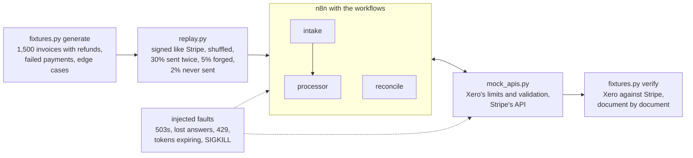
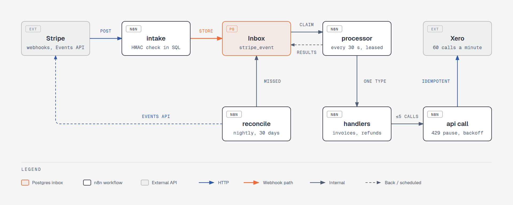
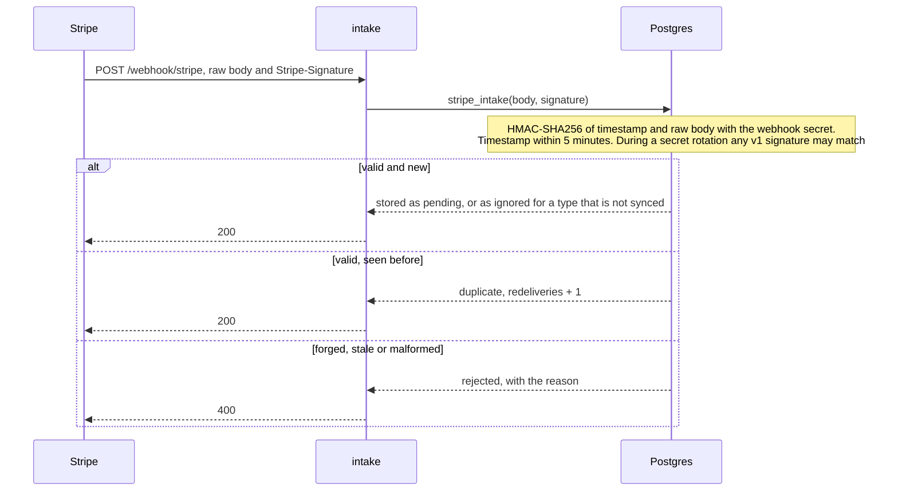
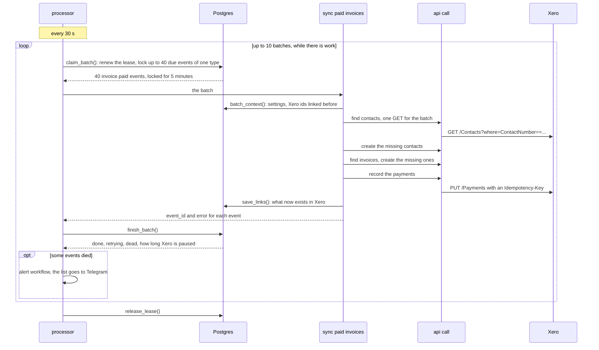
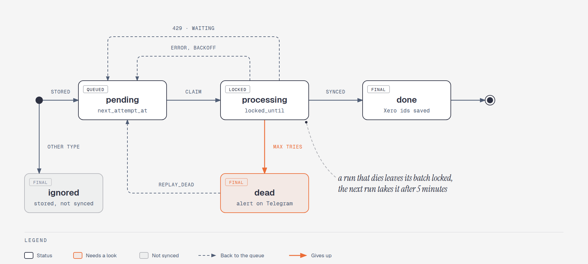
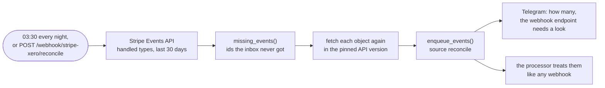
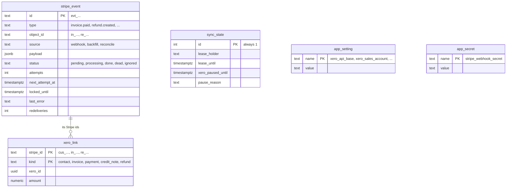

# Stripe → Xero sync on n8n

Every paid Stripe invoice becomes a paid Xero invoice (contact, invoice, payment into the bank account).
Every refund becomes a Xero credit note paid back out of that account. Failed card payments go to Telegram.

The hard part is not the mapping. It is everything that goes wrong between two APIs: Stripe sends
the same event twice, or out of order, or not at all. Xero allows 60 calls a minute and sometimes times out after
it has already saved the request. n8n restarts in the middle of a batch. This sync is built and tested for all of
that. Its end state is checked against Stripe, document by document.

- **Nothing is posted twice.** Every Xero document is found by a key that comes from Stripe before anything is
  created, and every write carries an idempotency key.
- **Nothing is lost.** Webhooks are stored before they are answered, a crash only delays work, and a nightly
  reconcile against Stripe's event log catches the webhooks that never arrived.
- **Xero's rate limit is respected,** with about 0.15 Xero calls per event, because events are synced in batches.
- **What cannot be posted correctly is refused,** announced on Telegram and kept for a replay after the fix.

*Developed in a private repository and published here as a snapshot, so the history starts at publication.*

## Contents

- [Proof](#proof)
- [How it works](#how-it-works): [intake](#store-then-answer), [batches](#batches-one-type-at-a-time),
  [what goes into Xero](#look-before-creating), [retries](#failures-and-retries), [rate limits](#rate-limits),
  [crashes](#crashes), [lost webhooks](#lost-webhooks)
- [Data model](#data-model)
- [Workflows](#workflows)
- [Run it](#run-it)
- [Operating it](#operating-it)
- [Going live](#going-live)
- [Limits](#limits)
- [Commercial support & migration](#commercial-support--migration)
- [Files](#files)

## Proof

`tools/soak.py` runs the whole thing on a local n8n against a mock of Xero and Stripe that enforces Xero's
documented limits and validation. Then it compares every contact, invoice, payment and credit note with what Stripe
says should exist. One full run:

| | |
|---|---|
| Stripe events | 1,753: 1,523 `invoice.paid`, 155 `refund.created`, 75 `invoice.payment_failed` |
| Deliveries | 2,328, shuffled, so refunds can come before their invoices. 530 repeats were recognised and dropped. 84 forged signatures got a 400 |
| Never delivered | 39, all found by `reconcile` |
| Xero errors | 3 calls answered 503. 4 answers were lost after Xero had saved a contact, an invoice, a payment and a credit note; the lookups found them on retry, so nothing was created twice |
| Xero rate limit | Another workflow spent the minute budget. The sync got a 429, paused all Xero work for 55 s and lost no attempts |
| Tokens | Expired every 90 s instead of 30 min: 6 × 401, each answered with a new token |
| n8n | Killed with SIGKILL while holding 40 events, back in 5 s. The 40 were retried once the lease ran out |
| Outcome | 1,750 synced. 3 refused on purpose: tax, EUR, paid partly from customer balance |
| Check | Xero matches Stripe: 35 contacts, 1,518 invoices, 1,671 payments, 153 credit notes, no duplicates, nothing missing |
| Cost | 259 Xero calls, 0.15 per event. 280 events needed a retry, none more than 3 attempts |
| Time | 14 minutes, 5 of them the stall after the kill |

How the soak is put together:



1. Fresh fixtures, a fresh mock with Xero's limits on and tokens that expire every 90 seconds, empty sync tables.
2. Events go to the intake webhook shuffled, 30% of them twice, plus 5% more with forged signatures. 2% are never
   sent at all.
3. While the processor drains the queue, Xero answers 3 calls with 503, saves a contact, an invoice, a payment and
   a credit note but loses the answers (504), and n8n gets SIGKILL in the middle of a batch.
4. `reconcile` runs to find the events that were never sent. Once work is going again, another workflow on the
   same Xero connection eats the minute budget until Xero refuses the sync too (429).
5. When there is nothing left to do, Xero is checked against Stripe and the numbers above are printed.

The fixtures carry the cases that break naive syncs: two customers with the same name, discounts, invoices with
more lines than the event holds, zero- and three-decimal currencies, $0 invoices, partial refunds, a refund that
arrives before its invoice, tax, a foreign currency and an invoice paid from customer balance.

## How it works

<picture>
  <source media="(prefers-color-scheme: dark)" srcset="docs/architecture-dark.png">
  
</picture>

All state lives in Postgres (`sql/schema.sql`): the inbox of events, which run holds the lease, what was created in
Xero, and the rate-limit pause. The workflows are thin and stateless, so n8n can restart at any point and nothing
is forgotten.

### Store, then answer

The intake checks the `Stripe-Signature` HMAC over the raw body inside Postgres, stores the event under its id and
answers 200 within milliseconds. A redelivered event is recognised by its id and counted. A forged one gets a 400.
The work itself happens later, at Xero's pace.



The signature is checked over the exact bytes Stripe sent, not over JSON that n8n parsed and wrote back, which
would not match. The webhook secret is read from a table (`app_secret`), so it never appears in a workflow or in an
execution log. Without it the intake fails closed and answers nothing but errors.

### Batches, one type at a time

Every 30 seconds the processor takes a lease (one run at a time), claims up to 40 due events of the same type and
hands them to that type's handler. For 40 paid invoices the handler makes at most 5 Xero calls: find contacts,
create contacts, find invoices, create invoices, record payments.



The oldest due event decides the type of the batch, so every kind of event gets its turn and Xero gets one request
per step instead of one per event. A run ends early when another run holds the lease, the queue is empty or Xero
is paused. If the handler forgets an event in its answer, that event counts as failed, so a bug in a handler cannot
make events disappear.

### Look before creating

Each step first asks Xero what already exists, by keys that come from Stripe: `ContactNumber` = the Stripe customer
id, `InvoiceNumber` = the Stripe invoice number, `Reference` = the Stripe invoice or refund id. A batch that failed
halfway simply runs again and creates nothing twice. PUTs also carry an `Idempotency-Key` (a hash of the request),
so a retry within Xero's 6 minutes gets the first answer back.

| Stripe | Xero | Found again by |
|---|---|---|
| customer | Contact `John Smith (cus_…)` with the email | `ContactNumber` = customer id |
| `invoice.paid` | `ACCREC` invoice, `AUTHORISED`, no tax, lines net of discounts on account `200` | `InvoiceNumber`, and its `Reference` must be the `in_…` id, or the number is taken and the event is refused |
| the payment of that invoice | Payment into bank account `090`, dated when Stripe marked the invoice paid | the invoice is paid only while its `AmountDue` equals the Stripe amount |
| `refund.created` | `ACCRECCREDIT` credit note, `AUTHORISED`, on account `200` | `Reference` = `re_…` |
| the money going back | Payment of the credit note out of bank account `090` | paid only while `RemainingCredit` equals the refund |
| `invoice.payment_failed` | nothing, one Telegram message per batch | |

The Xero invoice is already paid when a refund comes, so the refund cannot be allocated to it. It becomes a credit
note paid out of the same bank account, and each partial refund is its own credit note. A refund points at a
PaymentIntent, not an invoice, so the sync asks Stripe's `invoice_payments` which invoice it belongs to. Account
codes, the currency and the API addresses are rows in `app_setting`, not values in the workflows.

### Failures and retries

<picture>
  <source media="(prefers-color-scheme: dark)" srcset="docs/lifecycle-dark.png">
  
</picture>

A failed event is retried with backoff (30 s, 1 min, 2 min … up to 1 h) and is marked dead after 8 attempts. It is
marked dead at once if retrying cannot help (`PERMANENT:` errors, see [Limits](#limits)). Dead events are
announced on Telegram, and `SELECT replay_dead()` queues them again after a fix. A refund whose invoice is not in
Xero yet waits for up to 2 days without spending attempts. It goes as soon as its invoice is done, and is otherwise
checked again after half the time it has waited so far (30 s to 10 min).

| What happened | The event | Tried again | Counts as an attempt |
|---|---|---|---|
| synced | `done`, Xero ids saved in `xero_link` | | |
| an error, Xero down, a timeout | back to `pending` | after 30 s, 1 min, 2 min … up to 1 h | yes, `dead` after 8 |
| `PERMANENT:` error, a retry cannot help | `dead` at once | after `replay_dead()` | |
| `WAITING:` a refund before its invoice | back to `pending` | when the invoice is done, or after half the time waited so far | no, `dead` after 2 days |
| Xero answered 429 | back to `pending`, all Xero work paused | after `Retry-After` | no |
| the handler returned nothing for it | back to `pending` | as an error | yes |
| the run died | stays `processing` | when the lock runs out, after 5 minutes | already counted |

### Rate limits

Every Xero response says how many calls are left this minute. Below 5, the processor pauses all Xero work for
60 seconds before Xero has to refuse anything. If another integration on the same connection spends the budget and
Xero answers 429, all Xero work waits for `Retry-After` seconds, and no event loses an attempt. Stripe calls are
kept to 10 a second. The pause is one row in the database, so every run sees it, not only the one that hit it.

### Crashes

A run that dies holds its lease and the events it claimed for 5 minutes (`lease_ttl`), so processing stops for that
long. Then the next run takes them back and retries them; the lookups above make that safe. n8n itself is never
trusted to remember anything: all state is in the database. Only one run works at a time, because Xero gives one
budget of 60 calls a minute per organisation, and parallel runs would only buy 429s and races between events for
the same invoice.

### Lost webhooks

Stripe stops retrying after 3 days. Every night `reconcile` lists the last 30 days of handled events from Stripe's
Events API, which keeps events for 30 days. It queues the ones the inbox never received and announces them on
Telegram, since that means the webhook endpoint has a problem. Stripe renders a listed event in the API version the
account had on that day, so each missed object is fetched again in the pinned version.
`POST /webhook/stripe-xero/reconcile` with the ops token runs it on demand.



### Details that break naive syncs

Two customers named John Smith stay two Xero contacts: names carry the Stripe customer id, `John Smith (cus_…)`,
because Xero requires unique names. Names are cut to Xero's 255 characters. Discounts are netted per line. An
invoice with more lines than the event carries is posted as one line with the exact total. Amounts are converted
per Stripe's zero- and three-decimal currency lists. $0 invoices are skipped. A second event for the same invoice
joins the first one. A refund arriving before its invoice waits for it. Events rendered in an API version other
than the pinned `2026-08-26.dahlia` are refused, because tax fields differ between versions.

## Data model



Most of the logic is SQL, so it runs in one transaction with the data it changes, and `sql/test.sql` checks it
without n8n:

| Function | Called by | Does |
|---|---|---|
| `stripe_intake(body, signature)` | intake | checks the signature, stores the event, counts repeats |
| `claim_batch(holder, n, ttl)` | processor | renews the lease, locks up to n due events of the oldest type (`FOR UPDATE SKIP LOCKED`) |
| `batch_context(ids)` | handlers | the settings and the Xero ids already linked to these Stripe ids |
| `save_links(links)` | handlers | remembers what now exists in Xero |
| `finish_batch(claimed, results)` | processor | done, retry, wait, dead or pause for each event, and the totals |
| `pause_xero(seconds, reason)` | api call | stops all Xero work for a while |
| `release_lease(holder)` | processor | lets the next run start right away |
| `missing_events(ids)`, `enqueue_events(events, source)` | reconcile | finds and queues what never arrived |
| `replay_dead(ids)` | you | queues dead events again, all of them or the listed ones |

## Workflows

| Workflow | Trigger | Does |
|---|---|---|
| `intake` | `POST /webhook/stripe` | verify, store, answer |
| `processor` | every 30 s | lease, claim batches, dispatch by type, record outcomes, alert on dead events |
| `sync paid invoices` | processor | `invoice.paid` → contact, invoice, payment |
| `sync refunds` | processor | `refund.created` → credit note, refund payment |
| `notify failed payments` | processor | `invoice.payment_failed` → one Telegram message per batch |
| `api call` | handlers | every outbound request: auth, idempotency, rate limits, errors |
| `reconcile` | 03:30 daily, or `POST /webhook/stripe-xero/reconcile` | queue events the webhook never delivered |
| `alert` | other workflows, and as their error workflow | Telegram |

The workflows hold no secrets and no environment-specific values: URLs and account codes are in `app_setting`,
secrets are n8n credentials. The same JSON therefore runs against the mock and against the real APIs. The processor,
the handlers, `api call` and `reconcile` carry a sticky note that explains them, so the canvas reads the same as
this page.

## Run it

Needs n8n 2.x, PostgreSQL 14+ and Python 3.10+. Everything under `tools/` uses only the standard library.

```sh
# ~/.config/stripe-xero/env holds STRIPE_WEBHOOK_SECRET and OPS_TOKEN (random strings will do for the mock)
# ~/.config/n8nctl/dev.env holds N8N_URL and N8N_API_KEY of the local n8n
set -a; . ~/.config/stripe-xero/env; set +a
createdb stripe_xero_dev
psql -d stripe_xero_dev -f sql/schema.sql
psql -d stripe_xero_dev -v secret="$STRIPE_WEBHOOK_SECRET" <<'SQL'
UPDATE app_setting SET value = 'http://127.0.0.1:8765/xero/api.xro/2.0' WHERE name = 'xero_api_base';
UPDATE app_setting SET value = 'http://127.0.0.1:8765/stripe' WHERE name = 'stripe_api_base';
INSERT INTO app_secret VALUES ('stripe_webhook_secret', :'secret');
SQL
python3 n8nctl.py creds dev credentials.mock.json --env ~/.config/stripe-xero/env
python3 n8nctl.py push dev workflows -m "first push"
python3 tools/soak.py        # about 15 minutes, ends with "soak: OK"
```

The n8n credential "Sync DB" (Postgres) is the one thing to create by hand. The soak kills n8n with
`systemctl --user kill --signal=SIGKILL n8n.service`; pass `--kill-cmd` for another setup, or `--kill-cmd ''` to skip it.

Smaller steps: `tools/test_mock.py` checks the mock, `sql/test.sql` checks the database logic,
`fixtures.py generate` and `replay.py` feed events, and `fixtures.py verify` compares Xero with Stripe.

`n8nctl.py` moves the workflows between instances: `diff` shows what a push would change, `push` publishes them
(sub-workflows before their callers), `rollback` puts back what was live before the last push, and `pull` brings
edits made in the editor back into the files. It refuses to overwrite a workflow that someone edited on the target
since the last push.

## Operating it

The state of the sync is a few queries away:

```sql
-- what is in the queue
SELECT status, type, count(*) FROM stripe_event GROUP BY 1, 2 ORDER BY 1, 2;

-- why events died
SELECT id, type, attempts, last_error FROM stripe_event WHERE status = 'dead' ORDER BY received_at;

-- who holds the lease, and whether Xero work is paused
SELECT lease_holder, lease_until, xero_paused_until, pause_reason FROM sync_state;

-- what an invoice became in Xero
SELECT kind, xero_id, amount FROM xero_link WHERE stripe_id IN ('in_...', 'cus_...');

-- after a fix: every dead event again, or only some
SELECT replay_dead();
SELECT replay_dead(ARRAY['evt_...']);
```

Right after an outage of the webhook endpoint, run the reconcile instead of waiting for the night:

```sh
curl -X POST -H "Authorization: Bearer $OPS_TOKEN" https://<n8n>/webhook/stripe-xero/reconcile
```

Telegram gets a message when events die, when the reconcile finds events the webhook never delivered, when a card
payment fails, and when any of the workflows fails as a whole.

## Going live

1. Xero: a Custom Connection app (client credentials) with the scopes in `credentials.json`. Check that account
   codes `200` (sales) and `090` (bank) exist, or change them in `app_setting`.
2. Stripe: a restricted key with read access to invoices, invoice payments, refunds and events. Then a webhook
   endpoint pinned to the API version. Its signing secret goes into `app_secret`.
   ```sh
   stripe webhook_endpoints create -d url=https://<n8n>/webhook/stripe -d api_version=2026-08-26.dahlia \
     -d "enabled_events[]=invoice.paid" -d "enabled_events[]=refund.created" -d "enabled_events[]=invoice.payment_failed"
   ```
3. Fill `~/.config/stripe-xero/env`, run `n8nctl creds prod credentials.json --env …` and `n8nctl push prod workflows`.
4. Set `alert_chat_id` in `app_setting` to the Telegram chat that should get alerts.

For the n8n itself, the [production stack](https://github.com/nightloom-dev/n8n-production-stack) is a fitting
host: queue mode, monitoring and tested backups on one machine.

## Limits

Each of these is rejected (dead event, Telegram alert) rather than posted wrong:

- **Tax.** Invoices with tax are refused. Supporting them means mapping Stripe tax rates to Xero tax types per
  organisation.
- **Currency.** Only the Xero organisation's base currency (`xero_currency`).
- **Customer balance.** Invoices paid partly from customer balance or credit are refused.

Not handled:

- A refund that fails after it was posted (`refund.failed`) is not reversed in Xero.
- Stripe credit notes are not synced; refunds are.
- History older than 30 days is not backfilled, because that is where the Events API ends.
- `xero_link` remembers what exists in Xero. After resetting a Xero demo company, empty it.

## Commercial support & migration

This sync is built and maintained by [Nightloom Development](https://nightloom-dev.com). We take paid work around it:

- **Setup on your accounts:** your Stripe, your Xero organisation and your n8n, with a check afterwards that Xero matches Stripe.
- **Mapping changes:** your account codes, tax rates, other currencies, invoices paid from customer balance, more Stripe event types.
- **Fixes and reconciliation:** dead events, a mismatch between Xero and Stripe, a sync that stopped after an n8n upgrade or a Stripe API version change.
- **Migration:** moving off another Stripe to Xero integration without posting twice what is already in Xero, and loading history older than 30 days.

The first piece of work is fixed-price, so you can judge it before the rest. After that it's $30/h. We reply within one business day. We don't sell uptime guarantees: the sync runs on your n8n.

Email unwinned@nightloom-dev.com with what you need and where your n8n runs.

## Files

```
sql/schema.sql            inbox, lease, batching, retries, links: all state and most of the logic
sql/test.sql              self-check for schema.sql
workflows/*.json          the n8n workflows, in n8nctl's portable format
credentials.json          credential specs with ${VARS}; credentials.mock.json points them at the mock
tools/mock_apis.py        Xero and Stripe stand-in with Xero's limits, validation and idempotency
tools/fixtures.py         Stripe test data with the edge cases, and the check of Xero against it
tools/replay.py           delivers events like Stripe: signed, repeated, shuffled, some forged, some lost
tools/soak.py             the chaos run above
tools/test_mock.py        checks that the mock behaves like Xero
n8nctl.py                 pull, diff, push, rollback and credentials between n8n instances
docs/                     the diagrams in this README
```

## License

MIT
